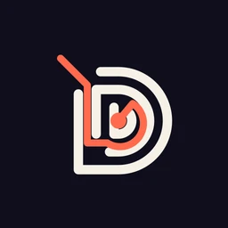
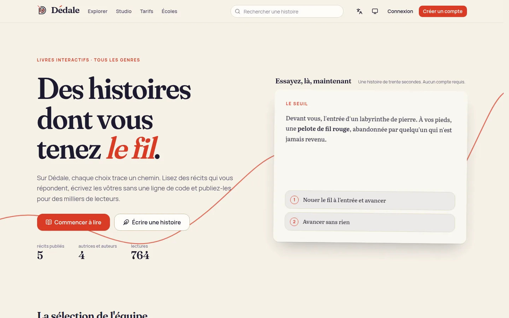
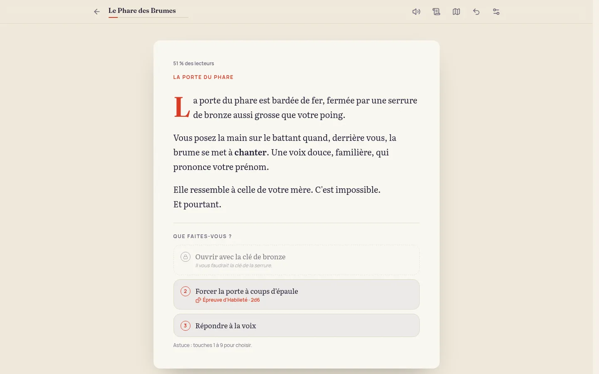
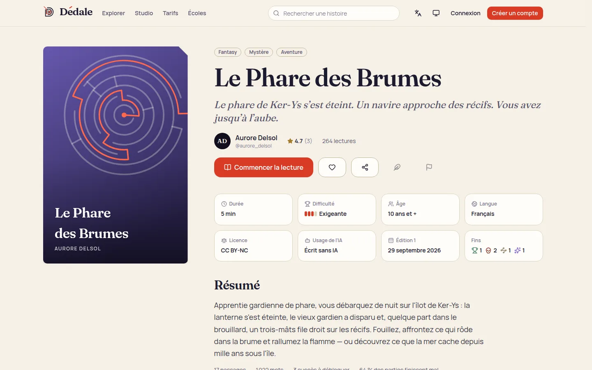
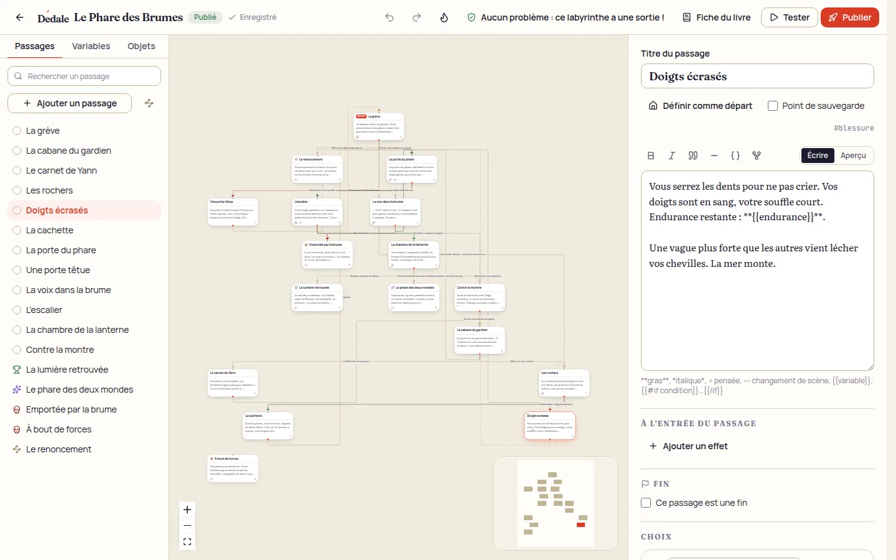
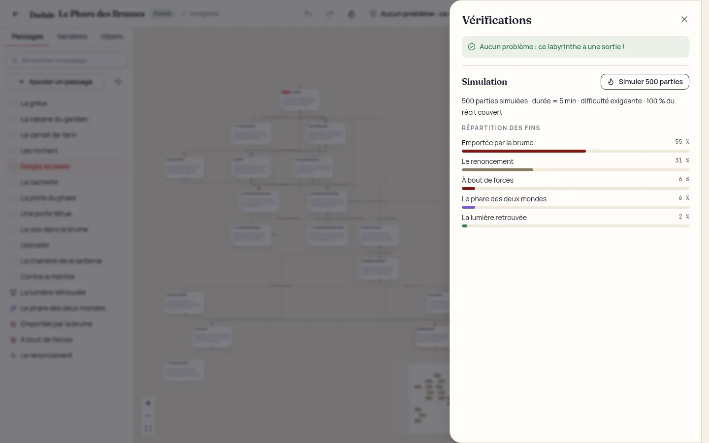
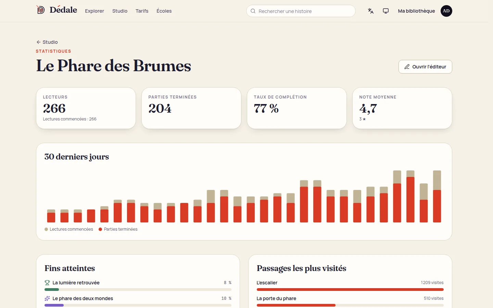
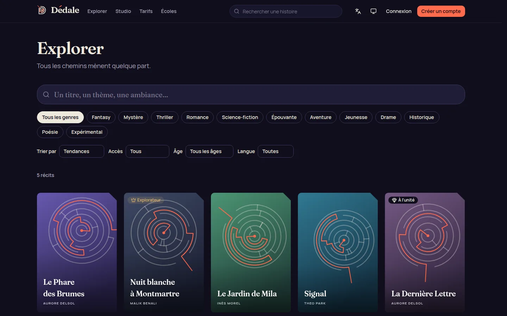
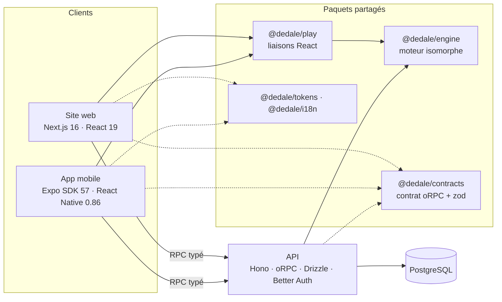

<p align="center">
  
</p>

<h1 align="center">Dédale</h1>

<p align="center">
  <strong>Des histoires dont vous tenez le fil.</strong><br />
  Lire, écrire et publier des livres interactifs — sur le web, iOS et Android.
</p>

<p align="center">
  <a href="https://github.com/bliaxx/vision/actions/workflows/ci.yml"></a>
</p>

---

**Dédale** est la plateforme des « livres dont vous êtes le héros », réinventée : un
catalogue de récits à embranchements dans tous les genres, une liseuse soignée qui
fonctionne hors ligne, un atelier d'écriture visuel qui vérifie et simule votre
labyrinthe avant publication, et un modèle économique qui rémunère d'abord les auteurs.

Le nom vient du mythe : Dédale a bâti le labyrinthe, Ariane a donné le fil. Ici, les
auteurs sont architectes, les lecteurs explorateurs — et le **fil rouge** trace le
chemin de chacun, du logo jusqu'à la carte de chaleur des lectures.



| Liseuse | Fiche d'un livre |
| --- | --- |
|  |  |

| Studio d'écriture | Simulation de 500 parties |
| --- | --- |
|  |  |

| Statistiques auteur | Thème sombre |
| --- | --- |
|  |  |

## Ce que fait Dédale

**Pour les lecteurs**
- Catalogue éditorialisé, recherche plein texte tolérante aux accents, filtres par genre, âge, accès.
- Liseuse immersive : épreuves aux dés, combats, inventaire, succès, retour en arrière,
  fil d'Ariane (carte de son chemin), codex des fins, « ce qu'ont choisi les autres lecteurs ».
- Accessibilité de premier plan : navigation clavier, lecteurs d'écran, lecture à voix haute,
  polices Atkinson Hyperlegible et Lexend, thèmes papier / sépia / nuit / contraste élevé.
- Hors ligne : le moteur tourne sur l'appareil ; la partie est sauvegardée localement puis
  synchronisée entre le web et le mobile.

**Pour les auteurs**
- Éditeur en graphe : passages, choix, conditions, effets, épreuves, combats, règles globales.
- Vérifications en direct (liens cassés, impasses, fins inaccessibles, expressions invalides…)
  et **simulation de Monte-Carlo** : durée de lecture, difficulté, couverture du récit.
- Test en conditions réelles (depuis le début ou n'importe quel passage), sauvegarde automatique
  avec détection des conflits, annuler/rétablir, import Twine, export livre-jeu papier.
- Publication d'éditions immuables : les lecteurs en cours finissent leur partie sur leur édition.
- Statistiques : fins atteintes, passages les plus visités, choix les plus disputés, retours lecteurs.
- **Muse**, assistante d'écriture IA (suggestions de choix, relecture critique) — toujours
  déclarée au lecteur par une étiquette de transparence.

**Pour la communauté et les partenaires** : avis, favoris, abonnements aux auteurs, pourboires,
signalements et file de modération, charte éthique, API publique documentée (OpenAPI).

## Démarrage rapide

Prérequis : Node.js 22, pnpm 10 (`corepack enable`), Docker.

```bash
pnpm install
cp .env.example .env
pnpm db:up          # PostgreSQL 18 (docker compose)
pnpm db:migrate
pnpm db:seed        # 5 récits, 9 comptes, statistiques réalistes
pnpm dev            # API sur :4000, site sur :3000
```

- Site : http://localhost:3000 · API : http://localhost:4000 · Référence interactive : http://localhost:4000/api/v1/docs
- Comptes de démonstration (mot de passe `dedale-demo-2026`) : `camille@demo.dedale.app` (lectrice,
  offre Explorateur), `aurore@demo.dedale.app` (autrice), `admin@demo.dedale.app` (modération).
- Mobile : `pnpm dev:mobile` puis ouvrir dans un simulateur ou un build de développement Expo.

Pile complète en conteneurs (builds de production) :

```bash
docker compose -f infra/docker-compose.yml --profile app up --build
docker compose -f infra/docker-compose.yml --profile app run --rm api node dist/seed.mjs --reset
```

Voir [docs/development.md](docs/development.md) pour les détails (tests, e2e, mobile, variables d'environnement).

## Architecture en bref

Monorepo **pnpm + Turborepo**, TypeScript strict de bout en bout. Le **moteur narratif** et le
**contrat d'API** sont partagés : le web, le mobile et le serveur exécutent exactement le même
code de jeu, et chaque appel réseau est typé à partir d'une seule définition.



| Dossier | Rôle |
| --- | --- |
| `apps/web` | Site (SSR/SEO), liseuse, studio, statistiques, modération — Next.js 16, Tailwind 4, TanStack Query |
| `apps/mobile` | App iOS/Android — Expo Router (onglets natifs), lecture hors ligne SQLite, SecureStore |
| `apps/api` | API modulaire hexagonale — Hono, oRPC (RPC + REST/OpenAPI), Drizzle, Better Auth, Stripe, Claude |
| `packages/engine` | Format de récit, langage d'expressions, balisage, moteur déterministe, analyse, simulation, imports/exports |
| `packages/play` | `useGame` et synchronisation des parties (stockage et transport injectés) |
| `packages/contracts` | Contrat d'API unique (schémas zod, erreurs typées, offres et droits) |
| `packages/api-client` | Client typé + fabriques TanStack Query, partagé web/mobile |
| `packages/tokens` | Identité visuelle : couleurs, typographies, thèmes de lecture, couvertures génératives |
| `packages/i18n` | Catalogues ICU français/anglais communs au web et au mobile |
| `packages/samples` | Récits de démonstration (vérifiés sans avertissement par l'analyseur) |
| `infra` | Dockerfiles, docker compose |

Détails et décisions : [architecture](docs/architecture.md) · [décisions (ADR)](docs/adr/).

## Qualité

- **Plus de 170 tests** unitaires et d'intégration (moteur, API sur PostgreSQL réel, web, mobile, paquets
  partagés) et **11 parcours Playwright** (bureau + mobile) exécutés sur les builds de production.
- CI GitHub Actions : lint Biome, types, tests, e2e, bundles Hermes iOS/Android, images Docker.
- Accessibilité visée : WCAG 2.2 AA — contrastes vérifiés par test sur tous les thèmes.
- Internationalisation : URLs localisées (`/livre/…`, `/en/story/…`), catalogues ICU validés par test.

## Documentation

| | |
| --- | --- |
| [Produit et fonctionnalités](docs/product.md) | Parcours, fonctionnalités, améliorations proposées, feuille de route |
| [Modèle économique](docs/business-model.md) | Marché, offres, partage des revenus, projections |
| [Identité visuelle](docs/brand.md) | Nom, logo, couleurs, typographie, ton, motion |
| [Architecture](docs/architecture.md) | Vue d'ensemble, flux, sécurité, performance, tests |
| [Format de récit](docs/story-format.md) | Spécification DSF v1 (JSON), expressions, balisage |
| [Développement](docs/development.md) | Installation, scripts, environnement, déploiement |
| [API](docs/api/openapi.json) | Spécification OpenAPI 3.1 générée depuis le contrat |
