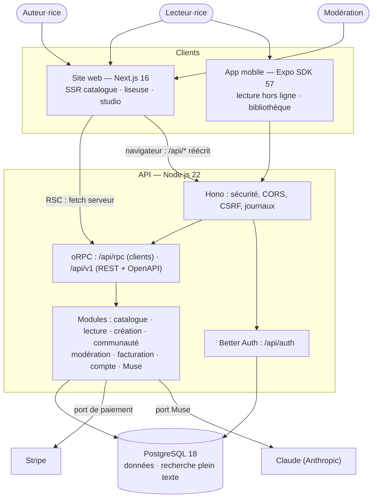
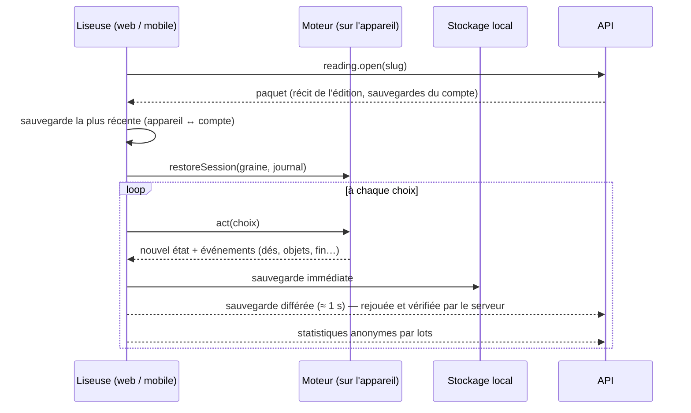

# Architecture

Ce document décrit comment Dédale est construit et pourquoi. Les décisions structurantes sont
détaillées dans les [ADR](adr/).

## Principes

1. **Un seul moteur, partout.** Le moteur narratif est une bibliothèque TypeScript pure,
   sans dépendance d'exécution autre que zod. Le site, l'app mobile et le serveur exécutent
   le même code : une partie jouée hors ligne sur un téléphone est rejouée à l'identique par
   le serveur pour vérifier une sauvegarde.
2. **Un seul contrat d'API.** Chaque route est déclarée une fois (`@dedale/contracts`) avec ses
   schémas d'entrée, de sortie et ses erreurs métier. Le serveur l'implémente, les clients en
   dérivent un client typé, la documentation OpenAPI en est générée.
3. **Monolithe modulaire, hexagonal.** Un seul déployable pour l'API, découpé en modules
   métier qui ne communiquent que par des services explicites ; l'infrastructure (paiement,
   IA, base) est derrière des ports remplaçables.
4. **Hors ligne d'abord pour la lecture.** Le serveur fournit un « paquet de lecture » ; tout le
   reste se passe sur l'appareil. Le réseau ne sert qu'à synchroniser.
5. **Sûr par défaut.** Validation à chaque frontière, aucune donnée non vérifiée ne traverse
   le système, pas de paiement simulé en production, secrets hors du code.

## Vue d'ensemble



## Monorepo

| Outil | Rôle |
| --- | --- |
| pnpm 10 (espaces de travail, catalogue de versions) | Une version par dépendance partagée ; React imposé en version unique (un doublon casse les hooks sous React Native) |
| Turborepo 2 | Orchestration et cache des tâches `build`, `typecheck`, `test` ; `turbo prune` pour les images Docker |
| TypeScript 6 strict | `strict` et `noUncheckedIndexedAccess` partout, `verbatimModuleSyntax` dans les paquets, l'API et le site |
| Biome 2 | Lint et formatage en une passe (règles a11y activées) |
| Vitest 5, Jest (jest-expo), Playwright | Tests unitaires, d'intégration, de composants natifs, de bout en bout |

Les paquets internes sont publiés **en TypeScript source** (`exports: ./src/index.ts`) : Next.js
(`transpilePackages`), Metro et tsdown les compilent directement, sans étape de build ni
fichiers `dist` à synchroniser.

## Le moteur (`@dedale/engine`)

| Module | Contenu |
| --- | --- |
| `format` | Schéma **DSF v1** (zod) : récit, passages, choix, variables, objets, succès, règles, réglages. Voir [story-format.md](story-format.md). |
| `expr` | Langage d'expressions : analyseur, évaluation, impression, **vérification de types** (`courage + 2 >= 7`, `has("clé")`, `visited("phare")`). |
| `markup` | Balisage de texte (`**gras**`, `*italique*`, `> pensée`, `---`, `{{variable}}`, `{{#if}}…{{/if}}`), rendu en blocs neutres (web → HTML, mobile → `<Text>`). Valeurs interpolées échappées. |
| `runtime` | Compilation (index et caches), état immuable, transactions, dés, épreuves, combats façon *Fighting Fantasy*, règles globales, succès, vue prête à afficher. |
| `session` | Une partie = **graine + journal d'actions**. Sauvegarde de quelques centaines d'octets, rejeu exact, retour en arrière (libre, aux points de sauvegarde, ou désactivé). |
| `analysis` | Graphe, diagnostics (liens cassés, impasses, fins inaccessibles, types, balisage…), statistiques, **simulation de Monte-Carlo** (difficulté, durée, couverture). |
| `export` / `import` | Livre-jeu papier (paragraphes numérotés et mélangés), import Twine (Twee 3). |

**Déterminisme.** Le hasard vient d'un générateur SFC32 initialisé par la graine de la partie.
Rejouer le journal reproduit exactement les mêmes dés. Conséquence : le serveur n'accepte une
sauvegarde qu'après l'avoir rejouée contre l'édition publiée (impossible de « tricher » sur une
fin ou un succès), et une partie commencée sur mobile continue sur le web.

## L'API (`apps/api`)

```text
src/
  http/            Hono, contexte de requête, middleware d'erreurs, routeur oRPC, OpenAPI
  modules/<nom>/   service (règles métier) · repository/queries (SQL) · router (adaptateur HTTP)
  infrastructure/  base (Drizzle, migrations, seed), auth, facturation (Stripe/simulé), IA (Claude/hors ligne)
  shared/          erreurs métier, UUIDv7, journalisation, limitation de débit, curseurs
  container.ts     racine de composition : tout le câblage, explicite et remplaçable en test
```

- **Erreurs** : les services lèvent des erreurs métier (`not_found`, `forbidden`, `conflict`…),
  traduites en un seul endroit en erreurs typées du contrat (`NOT_FOUND`, `CONFLICT` avec la
  révision courante, `UNPROCESSABLE_CONTENT` avec le rapport d'analyse…).
- **Lecture/écriture** : les écrans de lecture passent par des requêtes SQL dédiées (projections
  « carte de récit »), les écritures par des services ; les lectures partent en `GET` (cachables).
- **Concurrence** : le brouillon porte une révision ; un enregistrement avec une révision périmée
  est refusé (`CONFLICT`) au lieu d'écraser le travail fait dans un autre onglet.
- **Éditions immuables** : publier fige le document dans `story_versions` avec ses statistiques
  calculées (mots, fins, **durée et difficulté issues de la simulation**). Les parties en cours
  restent attachées à leur édition.
- **Recherche** : colonne `tsvector` générée (titre, accroche, résumé, mots-clés) avec
  `unaccent` et `pg_trgm`, index GIN. « phare brumes » trouve « Le Phare des Brumes ».
- **Classements** : note bayésienne (a priori 3,5 sur 5 avis fictifs) et tendance à
  décroissance exponentielle (demi-vie d'environ une semaine), calculées en SQL.
- **Statistiques communautaires** : événements anonymes (départ, passage, choix, fin) agrégés
  par lots en compteurs (par passage, par choix, par fin, par jour). Aucune trajectoire
  individuelle n'est conservée.
- **Ports** : `PaymentGateway` (Stripe ou simulé), `MuseEngine` (Claude ou hors ligne). Sans clé,
  l'app fonctionne entièrement en local ; en production, le paiement simulé est refusé sauf
  `DEMO_MODE` explicite.

### Authentification et sécurité

- Better Auth : sessions par cookie `HttpOnly` (web, même origine grâce à la réécriture `/api/*`),
  cookie conservé dans le trousseau iOS / Keystore Android sur mobile (SecureStore).
- Protection CSRF : toute requête d'écriture portant un en-tête `Origin` doit venir d'une
  origine de confiance ; CORS restreint aux mêmes origines.
- En-têtes de sécurité (Hono `secureHeaders`, Next : `nosniff`, `DENY`, `Referrer-Policy`,
  `Permissions-Policy`), limite de taille des corps, identifiant de requête, journaux JSON
  (pino) avec cookies et mots de passe masqués.
- Limitation de débit par action (avis, signalements, statistiques, Muse). L'implémentation
  mémoire convient à une instance ; le port `RateLimiter` permet de passer à Valkey/Redis
  lors d'une montée en charge horizontale.
- Rôles : lecteur, auteur, modérateur, administrateur ; droits d'accès aux récits calculés par
  une politique unique (`entitlement.policy.ts`) : gratuit, catalogue premium, achat, auteur.

## Le site (`apps/web`)

- **Next.js 16** (App Router, Turbopack, React Compiler, sortie `standalone`).
- **Server Components** pour tout ce qui doit être indexé (accueil, catalogue, fiches, auteurs) :
  HTML complet, JSON-LD `Book`, métadonnées, images OpenGraph générées par livre.
- **Îlots client** pour l'interactif : liseuse, studio (React Flow + zustand/immer), formulaires.
- **i18n** : next-intl, URLs localisées (`/livre/…` en français, `/en/story/…` en anglais),
  sitemap avec `hreflang`. Le `proxy.ts` négocie la langue.
- **Thème** : préférence en cookie, appliquée dès le rendu serveur (ni flash ni script inline).
- **Styles** : Tailwind CSS 4 branché sur les variables CSS générées par `@dedale/tokens` ;
  composants accessibles (Radix) habillés à la marque.

## L'app mobile (`apps/mobile`)

- **Expo SDK 57**, React Native 0.86 (nouvelle architecture), Hermes, React Compiler.
- **Expo Router** : onglets natifs (UITabBar sur iOS, Material 3 sur Android), pile modale pour la
  liseuse et la connexion, routes typées.
- **Hors ligne** : paquets de lecture et parties dans SQLite (`expo-sqlite/kv-store`), relus de façon
  synchrone et **revalidés par zod** à chaque lecture (un stockage corrompu ne plante jamais l'app).
- **Partagé avec le web** : moteur, `useGame` et synchronisation (`@dedale/play`), client d'API,
  catalogues de traduction, jetons de marque, couvertures génératives.
- **Natif** : haptique sur les dés et les fins, lecture à voix haute, focus du lecteur d'écran sur
  chaque nouveau passage, Dynamic Type, feuilles modales natives.

## Flux clés

### Lire un récit



### Écrire et publier

1. Chaque modification du studio met à jour le document en mémoire (historique d'annulation),
   relance l'analyse et programme une sauvegarde (1,2 s) avec la révision connue.
2. « Publier » force l'enregistrement, puis le serveur ré-analyse : une erreur bloquante renvoie
   `UNPROCESSABLE_CONTENT` et la liste des diagnostics, affichée dans la boîte de publication.
3. Sinon, une nouvelle édition immuable est créée, avec ses statistiques de simulation.

## Performance

- Le moteur compile chaque récit une fois (index, expressions et gabarits en cache) ; l'API garde
  les éditions compilées dans un cache LRU.
- Polices auto-hébergées (next/font, polices Expo importées graisse par graisse).
- Couvertures génératives en SVG : aucune image à héberger ni à télécharger.
- Images Docker minimales : API en bundle autonome (aucun `node_modules`), site en `standalone`.

## Stratégie de test

| Niveau | Où | Ce qui est vérifié |
| --- | --- | --- |
| Unitaire | `packages/*` | Expressions, balisage, moteur, sessions, analyse, simulation, contrastes WCAG, parité des traductions, validité ICU |
| Intégration | `apps/api/test` | Parcours complets contre PostgreSQL réel : auth, création, publication, lecture, sauvegardes, statistiques, avis |
| Composants | `packages/play`, `apps/web/test`, `apps/mobile/test` | `useGame`, synchronisation, store de l'éditeur, stockage hors ligne, liseuse native rendue et jouée |
| Bout en bout | `apps/web/e2e` | Découverte, recherche, i18n, 404, lecture au clavier, écriture + sauvegarde + test (bureau et mobile) sur builds de production |
| Build | CI | Bundles Hermes iOS/Android, images Docker |

## Déploiement

- **API** : image `infra/docker/api.Dockerfile` (Node 22 Alpine, utilisateur non privilégié,
  vérification de santé `/health`, disponibilité `/ready`). Migrations : `node dist/migrate.mjs`
  avant le démarrage (tâche de pré-déploiement).
- **Site** : image `infra/docker/web.Dockerfile` ou toute plateforme Node ; `API_INTERNAL_URL`
  pointe vers l'API sur le réseau privé.
- **Base** : PostgreSQL 16+ managé (extensions `unaccent` et `pg_trgm`).
- **Mobile** : EAS Build (profils `development`, `preview`, `production` dans `apps/mobile/eas.json`,
  canaux déjà nommés pour brancher EAS Update et livrer les correctifs JavaScript sans passer
  par les stores).
