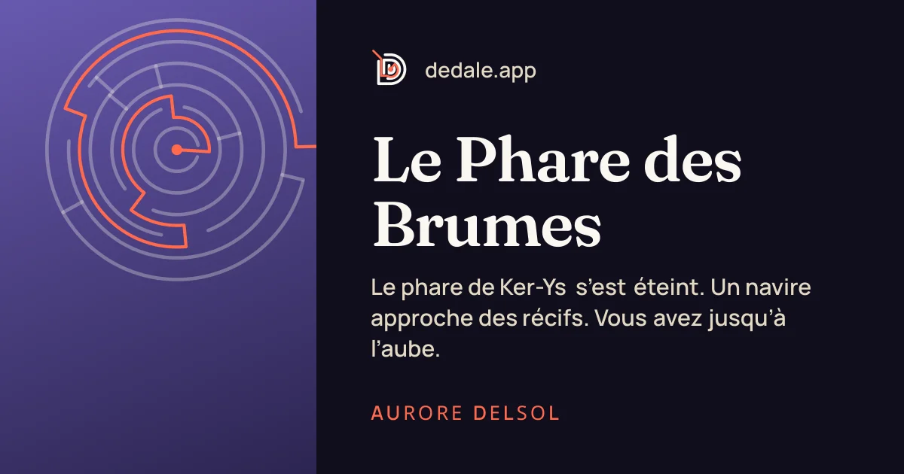

# Identité visuelle

> **Dédale** — *Des histoires dont vous tenez le fil.*
> EN : *Stories where you hold the thread.*

Toutes les valeurs ci-dessous sont définies une seule fois dans `packages/tokens` et
distribuées au web (variables CSS `--dd-*`, Tailwind) et au mobile (`nativeTheme`). Ce document
en explique l'intention ; le code fait foi.

## Le nom

Dédale est l'architecte du labyrinthe de Crète ; Ariane donne à Thésée le fil qui lui permet
d'en sortir. La métaphore couvre tout le produit :

- les **auteurs** sont des architectes : ils bâtissent des labyrinthes de récits ;
- les **lecteurs** sont des explorateurs : ils choisissent leur chemin ;
- le **fil rouge** matérialise ce chemin, partout — dans le logo, les liens, la carte du
  parcours, la carte de chaleur des lectures, les couvertures.

Le mot est court, français, prononçable dans toutes les langues cibles, et sans connotation
d'âge : il convient au polar comme à la jeunesse. Les offres prolongent le mythe : on s'y
promène (*Promeneur*), on l'explore (*Explorateur*), on en devient l'architecte (*Architecte*).

Règles d'écriture : toujours **Dédale** avec l'accent ; `dedale` uniquement pour les
identifiants techniques (domaine, paquets, schéma d'URL `dedale://`).

## Logo

- **Monogramme** : un « D » dessiné comme un labyrinthe de trois murs concentriques ; le fil
  rouge y entre en haut à gauche et rejoint le cœur, marqué d'un nœud. Géométrie : `monogram`
  dans `packages/tokens/src/brand.ts` (grille 64 × 64, traits arrondis).
- **Logotype** : « Dédale » en Fraunces demi-gras ; l'accent aigu est remplacé par un trait de
  fil rouge.
- **Usages** : espace de protection égal à la hauteur du nœud × 4 ; taille minimale 16 px
  (monogramme) et 72 px de large (logotype) ; le fil reste toujours vermillon, sur fond clair
  comme sombre. Ne pas déformer, ombrer ni recolorer les murs en vermillon.
- **Icônes d'application** : monogramme papier sur fond encre (iOS), icône adaptative et
  monochrome (Android), écrans de démarrage clair et sombre — sources SVG dans
  `apps/mobile/assets/brand`.

## Couleurs

L'encre, le parchemin et le fil rouge.

| Rôle | Nom | Valeur | Usage |
| --- | --- | --- | --- |
| Fond sombre | Encre 950 | `#0F0E1C` | La nuit du labyrinthe : thème sombre, icône, sections immersives |
| Fond clair | Parchemin 200 | `#F6F1E7` | La page du livre : fond de l'interface claire |
| Signature | Fil 600 / 400 | `#D93B25` / `#FF6A4D` | Toujours le chemin, le choix, l'action (clair / sombre) |
| Premium, succès | Laiton 600 / 400 | `#A67C2E` / `#D9B26A` | Offres payantes, notes, succès débloqués |
| Victoire | Mousse 500 | `#3E7D5C` | Fins heureuses, validation |
| Secret | Améthyste 500 | `#7A5BC7` | Fins secrètes, découvertes rares |
| Mort | Cramoisi 800 | `#7A1A12` | Fins tragiques |

Chaque genre a sa teinte (fantasy `#5B4BA8`, mystère `#2E3A59`, science-fiction `#1F6F8B`,
jeunesse `#3E8E6A`…) utilisée par les couvertures génératives.

**Thèmes de lecture**, indépendants du thème de l'interface : *Papier*, *Sépia*, *Nuit*,
*Contraste élevé* (noir, blanc, jaune). Tous les couples texte/fond de l'interface et des
thèmes de lecture sont **vérifiés par un test automatisé** (contraste WCAG AA ≥ 4,5:1 pour le
texte courant).

## Typographie

| Rôle | Police | Pourquoi |
| --- | --- | --- |
| Titres | **Fraunces** (demi-gras, axes « soft ») | Un serif littéraire, chaleureux, légèrement excentrique : l'objet livre |
| Lecture | **Literata** | Conçue pour la lecture longue sur écran (Google Play Livres) |
| Interface | **Manrope** | Sans-serif géométrique, lisible aux petites tailles |
| Accessibilité | **Atkinson Hyperlegible Next** | Formes distinctes pour les lecteurs malvoyants |
| Dyslexie | **Lexend** | Espacements élargis, réduit la fatigue de lecture |
| Code | **JetBrains Mono** | Expressions et conditions dans le studio |

Échelle modulaire de rapport 1,25 ; tailles de lecture au choix du lecteur (16 à 28 px) ;
interligne de lecture 1,6 à 1,7. Toutes les polices sont auto-hébergées (aucune requête vers un
service tiers à l'affichage).

## Éléments signature

- **Couvertures génératives** : chaque livre sans illustration reçoit un labyrinthe circulaire
  unique, calculé depuis son identifiant, que le fil rouge résout jusqu'au centre. Identiques sur
  le web, le mobile et les images de partage.
- **Coin corné** des cartes de livres, **grain de papier** discret sur les grandes surfaces.
- **Lettrine** vermillon au début de chaque passage (web), ornement de fil entre les scènes.
- **Fil d'Ariane** : la carte du chemin parcouru par le lecteur ; **carte de chaleur** : le chemin
  de tous les lecteurs, vu par l'auteur.
- **Tracé du fil** : une animation de 1,2 s réservée aux moments narratifs (arrivée sur l'accueil,
  fin atteinte).

## Mouvement

Durées : 80 / 140 / 220 / 420 ms, et 1 200 ms pour le tracé du fil. Courbes : standard
`cubic-bezier(0.2, 0, 0, 1)`, fil `cubic-bezier(0.22, 1, 0.36, 1)`. Tout mouvement est coupé
quand le système demande de réduire les animations.

## Ton

- On **vouvoie** le lecteur, sans familiarité ni jargon.
- Des phrases courtes, concrètes, qui donnent envie : « Que faites-vous ? », « Reprendre à
  « La grève » ».
- Les erreurs parlent le langage du labyrinthe, sans jamais culpabiliser : « Ce chemin ne mène
  nulle part. », « Le fil s'est rompu. », « Aucun problème : ce labyrinthe a une sortie ! ».
- On nomme les choses du métier : passage, choix, épreuve, fin, édition.
- En anglais, même registre : *“This path leads nowhere.”*, *“The thread snapped.”*

## Images de partage

Générées à la volée pour chaque livre (couverture, titre, accroche, auteur) et pour le site
(monogramme, promesse), dans les polices de la marque.
